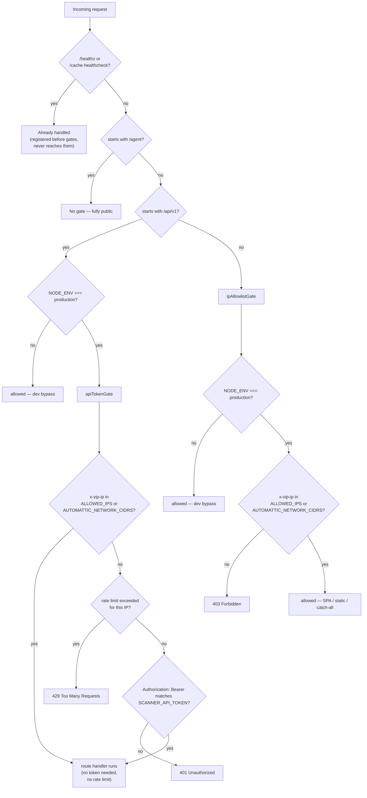

# feat: Path-Scoped Access Control (IP-Gated UI, Token-Gated API)

**Date:** 2026-08-28
**Type:** feat
**Depth:** Standard

---

## Summary

Replace WordPress VIP's Dashboard-level "IP Allow List" — which blocks at the edge, uniformly, for every path — with app-level middleware in this Express server, so the UI and the public REST API can carry different rules: the UI stays IP-restricted, the API (public federal data) becomes IP-open but requires a shared-secret bearer token for abuse prevention. Disabling the Dashboard setting itself is an explicit manual follow-up, not part of this plan.

---

## Problem Frame

The Dashboard IP Allow List operates at VIP's edge/load balancer, before any request reaches this app. It applies identically to every path and every request type (cached or not), so there is no way to open the API while keeping the UI restricted using that feature alone. `server/src/index.ts` currently has no app-level access control at all — CORS, security headers, and SSRF protection exist, but nothing gates who can reach a route. The env vars `AUTH_USER`/`AUTH_PASSWORD` are documented in `.env.example` and `README.md` as enabling HTTP Basic Auth, but grepping the server finds zero code implementing them — they're vestigial, confirming access control today lives entirely at the VIP edge, undocumented in application code.

---

## Requirements

- **R1** — Research VIP's documented client-IP header and Automattic-network detection mechanism for Node before designing middleware (don't guess the header name).
- **R2** — Front-end IP-check middleware: allowed-IP list from config/env, applies only to non-API routes, 403 for non-matching IPs, always allows Automattic-network/proxied requests through.
- **R3** — API token middleware: applies only to `/api/v1/*`, reads expected token from an env var, constant-time comparison, 401 (not 403) on missing/wrong token, no IP check required for external callers. *(Amended during planning — see the dual-path decision in Key Technical Decisions and System-Wide Impact: a request already matching the UI's allowed-IP list is also admitted without a token, confirmed with the user, because the existing React SPA calls `/api/v1/*` directly from the browser with no way to safely carry a secret.)*
- **R4** — Confirm whether these routes sit behind VIP-managed edge caching; if so, exclude gated routes from that cache or set explicit `Cache-Control` so a cached response can't skip the middleware.
- **R5** — Tests: front-end blocked/allowed/Automattic-simulated; API 401 (no token) / 401 (wrong token) / 200 (correct token) / arbitrary IP still succeeds with a valid token; a basic rate limit on the token-gated route (after confirming no redundant VIP-platform-level limit already covers it).
- **R6** — Document the decision ADR-style: why the Dashboard list couldn't do this, the chosen pattern, where the token lives and how to rotate it — framed as reusable for other VIP Node apps with the same "public API, gated UI" shape.

---

## Research Findings

**Local (`server/src/middleware/ssrf-protection.ts`, `server/src/index.ts`, `server/src/routes/chat.ts`, `server/src/config.ts`):**
- The established middleware shape in this repo is a pure, Express-free decision function (`validateUrlForSsrf`) plus a thin `(req, res, next)` wrapper — and the pure function is what gets unit-tested (`node:test`, no `supertest`/mocked req-res anywhere in the repo). New middleware should follow this exactly.
- `ipaddr.js` is already a dependency, already used for CIDR matching in `ssrf-protection.ts` — no new dependency needed for IP-list matching.
- Client IP is read in exactly one place today (`chat.ts`'s rate limiter): `req.ip ?? req.socket.remoteAddress`. `app.set('trust proxy', ...)` is never configured anywhere, so `req.ip` currently reflects the raw socket, not any forwarded-for chain.
- `chat.ts` has an existing in-memory `Map<string, number[]>` sliding-window rate limiter (20/5min/IP) — not extracted to a shared util. `query.ts` does **not** actually rate-limit despite CLAUDE.md's claim that it does (verified via `git log -p`); that's stale documentation, unrelated to this plan.
- No `docs/adr/`, `docs/decisions/`, or RFC convention exists anywhere in the repo — this plan introduces the convention rather than following one.
- `server/src/apiRegistry.ts` explicitly excludes `/agent/*` ("HTML browsing surface") and `/cache-healthcheck` from the documented API registry — confirms `/agent/*` is already treated as its own out-of-band surface, and that adding middleware needs no `apiRegistry.ts` changes.
- No auth/rate-limit/security npm packages exist in `server/package.json` (no `helmet`, `express-rate-limit`, `express-basic-auth`, `dotenv`) — everything cross-cutting here is hand-rolled inline, consistent with a lean dependency footprint.

**System-impact (repo grep, confirmed):**
- `client/src/lib/api.ts`'s `request()` helper calls `/api/v1/*` directly from the browser (`fetch('/api/v1' + path, ...)`), with no `Authorization` header and no way to safely acquire one — anything shipped in the built JS bundle is visible via view-source, and a session/cookie mechanism is explicitly out of scope (no user accounts). A pure token-only gate on `/api/v1/*`, as originally worded in R3, would 401 every SPA data fetch the moment this ships.
- `server/src/services/claude-chat.ts`'s `callRest()` calls `/api/v1/*` over loopback (`http://127.0.0.1:${config.port}/api/v1`) for its tool-use loop (`resolve_agency`, `get_stats`, `run_sql`, etc.), also with no `Authorization` header — same break, different caller.
- `server/src/scheduler.ts` calls `importFromGsa()` and `scanAndStore()` as direct in-process function calls, not HTTP — confirmed unaffected by either gate.

**External (docs.wpvip.com, verified — see Sources & Research):**
- VIP computes and forwards **`x-vip-ip`** to origin applications (WordPress and Node alike) as its resolved "most probable client IP" header — it already applies `True-Client-IP` vs. leftmost-`X-Forwarded-For` fallback logic internally, so a Node app should read this header directly rather than re-implementing that fallback itself.
- There is **no documented Node equivalent** of PHP's `is_proxied_request()` / `A8C_PROXIED_REQUEST`. The public `vip-go-mu-plugins` source only shows the `false` default; the logic that flips it true for genuine Automattic-internal traffic is proprietary edge infrastructure, not a header or IP range VIP publishes. This is a genuine gap (see Risks).
- VIP's edge cache treats Node.js identically to WordPress: GET/HEAD only, and `Cache-Control: private` / `no-cache` / `no-store` all bypass it — documented with a literal Express.js example. This confirms R4 is a real, not hypothetical, concern: any cacheable GET response served before this middleware runs would let a disallowed IP or tokenless client receive a stale-but-valid response straight from the edge, skipping both gates entirely.
- VIP does apply a global, non-customizable edge-level crawler rate limit (Node and WordPress alike) — but nothing that constitutes a general per-route API rate limit, so an app-level limiter for the token route is not redundant with anything VIP already does.

---

## Key Technical Decisions

- **Client IP source: `x-vip-ip` header, not `req.ip`.** VIP documents this header specifically as the resolved client IP for origin apps (Node included), with its own `True-Client-IP`/`X-Forwarded-For` fallback already applied upstream. Reading it directly means `app.set('trust proxy', ...)` is not needed and its associated hop-counting pitfalls are avoided. Falls back to `req.socket.remoteAddress` only when the header is absent (i.e., local/dev, where VIP's edge isn't in front of the request).
- **Automattic-network bypass: configurable CIDR list, not a magic header.** No Node-equivalent of `is_proxied_request()` is documented. Implemented as an `AUTOMATTIC_NETWORK_CIDRS` env var (empty by default), matched with the same `ipaddr.js` CIDR approach as `ssrf-protection.ts`. Populating it with real ranges requires VIP Support/TAM (see Risks) — this is a genuine gap between what the requirement asks for and what VIP's docs make verifiably possible today.
- **IP gate is skipped outside `NODE_ENV=production`.** Mirrors the existing CORS dev/prod branch in `index.ts` (`ALLOWED_ORIGIN` env var in prod, localhost regex in dev) — keeps local development unblocked without a special-case dev IP, while the pure decision function is still fully unit-testable independent of environment.
- **API token gate is dual-path: a valid token OR an already-allowed IP, not token-only.** Confirmed with the user after system-impact analysis surfaced that the SPA's own browser-side calls to `/api/v1/*` have no safe way to carry a secret (a client-bundled token is view-source-visible; a session/cookie mechanism is out of scope). `apiTokenGate` first checks the caller's IP against the same `isIpAllowed()` used by the front-end gate (imported from `ipAllowlist.ts`, not duplicated) — if it matches `ALLOWED_IPS` or `AUTOMATTIC_NETWORK_CIDRS`, the request proceeds with **no token required and no rate limit applied**. Only when the IP doesn't match does the gate fall through to rate limiting and then the token check — rate limiting runs before token validation specifically so repeated wrong-token guesses are throttled too, not just successful requests. This softens R3's literal "no IP check at all" wording by design: the requirement's real intent — external/anonymous callers must be able to reach the API with just a token, regardless of their IP — still holds exactly (an arbitrary, disallowed IP with a valid token still succeeds); what's added is that already-trusted (allowed-IP) traffic keeps working exactly as it does today, with zero client-side changes.
- **The rate limiter guards the whole non-allowlisted-IP path — both wrong-token guesses and successful token calls — not the IP-allowed path.** R5's stated purpose is preventing a *leaked or guessed token* from becoming a spam vector; checking the limit before validating the token means repeated wrong guesses get throttled exactly like repeated valid calls, closing an automated-guessing gap a token-only check would leave open. Applying the same limit to the SPA's own normal browsing traffic (which takes the IP-allowed path) would throttle legitimate use for a problem that path doesn't have, so that path stays exempt.
- **Internal loopback calls attach the real token explicitly, rather than relying on the dual-path IP check.** `claude-chat.ts`'s `callRest()` runs from `127.0.0.1`, which has no reason to appear in `ALLOWED_IPS` (an external corporate/office IP list) and shouldn't need to just to keep an internal integration working. It sends `Authorization: Bearer ${config.scannerApiToken}` on every request instead — the server already holds this value in-process, so there's no exposure risk.
- **Token comparison hashes both sides to a fixed length before `crypto.timingSafeEqual`.** `timingSafeEqual` throws on mismatched buffer lengths, which is a common pitfall — comparing SHA-256 digests of both inputs sidesteps that while preserving constant-time behavior. An unset/empty `SCANNER_API_TOKEN` always fails closed; it is never treated as "no token required" even if the incoming header is also empty.
- **`Cache-Control: private, no-store` on every gated response — with a caveat confirmed against existing code.** Both gate middlewares set this header before their respective route handlers run. Several existing `/api/v1/*` handlers (`sites.ts`, `stats.ts`) already call `res.set('Cache-Control', ...)` themselves on the success path with their own value (e.g. `private, max-age=300`), which in Express replaces rather than merges with the gate's earlier value. Today this is harmless — every existing route's own value still includes `private`, one of VIP's three documented bypass tokens (`private`/`no-cache`/`no-store` all bypass identically) — but it means the gate's `no-store` is not actually the value VIP's edge sees for those routes, and the safety property rests on an invariant (every `/api/v1` route's own `Cache-Control`, if it sets one, must keep one of those three tokens) that isn't enforced anywhere. This is recorded as an explicit invariant in the ADR (U5) and a verification check in U4 rather than silently assumed.
- **Rate limiter: reuse the existing in-memory pattern, extracted into a small shared factory.** `chat.ts`'s Map-based sliding window is copied into `server/src/utils/rateLimit.ts` as a small `createRateLimiter(max, windowMs)` factory, used by the new token-gate middleware. `chat.ts` itself is left untouched — refactoring it to use the new factory is deferred (see Scope Boundaries), not required for this feature.
- **Startup logs a prominent warning (not a hard failure) when `NODE_ENV=production` and `AUTOMATTIC_NETWORK_CIDRS` is empty.** Mirrors the existing `console.log` config-status pattern in `index.ts` (e.g. "GSA API: ✓ configured / ✗ not configured"), so the Automattic-network gap from Open Questions is visible to whoever operates this deploy, not just documented in a plan no one re-reads at deploy time. A hard startup failure would be disproportionate — the gap is an accepted interim state, not a fatal misconfiguration — but silence would let someone disable the Dashboard list without realizing the app-level Automattic exception is still a no-op.
- **`/agent/*` is fully public — no IP gate, no token.** Per product decision: it's a crawler/agent-facing HTML surface over the same public data (already excluded from the documented API registry); requiring a token would defeat its anonymous-crawl purpose.

### Alternatives Considered

- **Reading `True-Client-IP` directly** (what VIP's reverse-proxy docs use, PHP-only) instead of `x-vip-ip` — rejected because `x-vip-ip` is VIP's own documented, pre-resolved answer for origin apps and already encodes the same fallback logic; re-deriving it ourselves risks drifting from VIP's own resolution the next time their edge topology changes.
- **Keeping the Dashboard IP Allow List active in parallel**, scoped down to just its Automattic-network exception, until real CIDR ranges are obtained — not adopted as the default plan (the user wants a full app-level replacement), but recorded in Risks as the safer interim fallback if VIP Support can't supply ranges before this ships.

---

## High-Level Technical Design

Routing decision for every incoming request, evaluated once the shared middleware (security headers, CORS, `express.json`) has run:



Both `E5` and `F3` set `Cache-Control: private, no-store` before the response is sent.

---

## System-Wide Impact

Every existing consumer of `/api/v1/*` was checked against the new gate:

| Consumer | Path | Impact | Handling |
|---|---|---|---|
| React SPA (`client/src/lib/api.ts`) | browser → `/api/v1/*`, same-origin | Would 401 on every call — no header to attach one | Covered by the dual-path IP-allow branch; the SPA is only served to already-allowed IPs, so its own API calls keep working unchanged. **No client code changes.** |
| In-app Chat (`server/src/services/claude-chat.ts`) | server loopback (`127.0.0.1`) → `/api/v1/*` | Would 401 — loopback IP has no reason to be in `ALLOWED_IPS` | `callRest()` explicitly attaches `Authorization: Bearer ${config.scannerApiToken}` (U4). |
| Scheduler (`server/src/scheduler.ts`) | in-process function calls (`importFromGsa()`, `scanAndStore()`) | None — never goes over HTTP | No change needed. |
| `/agent/*` (`server/src/routes/agent.ts`) | crawler-facing HTML, own mount point | None — outside `/api/v1`, deliberately left open per the earlier product decision | No change needed. |
| External API consumers (the actual target of R3) | any IP → `/api/v1/*` with a token | New capability — previously blocked entirely at the VIP edge regardless of any token | Enabled by this plan; no prior behavior to preserve. |

No other internal or external caller of `/api/v1/*` was found in this repo (confirmed via full-repo grep for the base path and for loopback fetch patterns).

---

## Scope Boundaries

**In scope:** app-level IP-allowlist middleware for UI routes, app-level token middleware + rate limiter for `/api/v1/*`, config/env plumbing, wiring into `index.ts`, tests for both gates, an ADR documenting the decision.

**Explicitly out of scope (per original request):**
- Disabling the Dashboard IP Allow List itself — manual VIP Dashboard change, done after this ships and is verified.
- Any user accounts, sessions, or login flow — intentionally lightweight, not a full auth system.

### Deferred to Follow-Up Work

- Correcting CLAUDE.md's stale claim that `/api/v1/query` is rate-limited (it isn't, and never has been per `git log`) — unrelated documentation cleanup surfaced during research.
- Refactoring `chat.ts`'s existing inline rate limiter to use the new shared `server/src/utils/rateLimit.ts` factory, for consistency — not required for this feature to work.
- Removing the vestigial, unimplemented `AUTH_USER`/`AUTH_PASSWORD` env vars from `.env.example`/README — the same "documented but not real" pattern this plan fixes, but a separate cleanup the user didn't ask for here.
- Masking/redacting secret values returned by `GET /api/v1/settings` — pre-existing behavior, now reachable by anyone holding a leaked `SCANNER_API_TOKEN` (see Risks), but a separate hardening effort.

---

## Open Questions

- **Automattic-network CIDR ranges are not publicly documented.** Requesting the actual list from VIP Support/TAM is a prerequisite for R2's "always allow Automattic-network requests" to be more than a no-op — flagged here rather than guessed at. Until populated, `AUTOMATTIC_NETWORK_CIDRS` stays empty and Automattic engineers needing UI access must be added to `ALLOWED_IPS` individually or use the still-active Dashboard list in the interim.
- **Which header carries the bearer token isn't user-specified.** This plan uses the standard `Authorization: Bearer <token>` convention; confirm this is acceptable for whatever internal/external client is expected to call the token-gated API before implementation.
- **`x-vip-ip` is trusted as unspoofable, but nothing found in research explicitly confirms VIP overwrites a client-supplied copy of that header before it reaches the origin.** Every gate in this plan — both the front-end IP allowlist and the API gate's dual-path bypass — treats `req.headers['x-vip-ip']` as ground truth. VIP's docs establish that VIP *computes and forwards* this header, but not explicitly that a request arriving with its own `X-Vip-IP` header set by the caller gets that value stripped/overwritten rather than passed through. If it isn't stripped, and the origin is reachable by any path other than through VIP's edge (e.g., a non-production VIP environment slot, or container-internal access), an external caller could set `X-Vip-IP: <an-allowed-IP>` themselves and bypass both gates entirely — including reaching mutating routes (see the mutation-surface risk below) with zero token and zero rate limit. **Verify this explicitly with VIP Support/docs before shipping** — it's the one assumption this entire design rests on that wasn't independently confirmed in research.
- **Does VIP set `NODE_ENV=production` uniformly across every deployed-and-reachable environment slot** (not just the one literally named "production" — e.g. a `develop`/`staging` VIP environment that's still internet-reachable)? Both gates no-op entirely when `NODE_ENV !== 'production'`. If any reachable non-"production"-named slot doesn't set this, that slot ships with no access control at all. Confirm before relying on this branch as the dev/prod switch; if the assumption doesn't hold, an explicit toggle env var (rather than piggybacking on `NODE_ENV`) would be needed instead.

---

## Risks & Dependencies

- **Sequencing risk:** this middleware must be deployed and verified working *before* the Dashboard IP Allow List is disabled, or there's a window with no protection at all. Recommend a brief overlap where both are active. This is currently only a prose recommendation with no enforcement mechanism — mitigated in part by the startup warning described below, but the actual Dashboard change itself has no code-level gate stopping someone from disabling it early. The ADR (U5) records this as an explicit, checkable precondition list (middleware deployed + verified in production; `AUTOMATTIC_NETWORK_CIDRS` populated or consciously accepted empty) rather than leaving it as a single "recommend" sentence.
- **No verified Automattic-network signal in Node** (see Open Questions) — mitigate by getting real CIDR ranges from VIP Support before treating the app-level gate as a full replacement for the Dashboard list's Automattic exception. Because this gap could otherwise go unnoticed until someone actually disables the Dashboard list, the server logs a prominent startup warning (per U4) when running in production with `AUTOMATTIC_NETWORK_CIDRS` empty (a warning, not a crash — the app should still start; the interim gap is accepted, not silently invisible).
- **Broadened blast radius of a leaked token, across a wider surface than "public data abuse" implies:** the token gates all of `/api/v1/*`, not just read-only public-data routes. Confirmed reachable with just the token: `PUT /api/v1/settings/:key` (can rewrite `ANTHROPIC_API_KEY` and other settings), `GET /api/v1/settings` (returns all values unmasked, pre-existing behavior), `POST /api/v1/scans` and `PUT /api/v1/sites/:domain` (site data mutation), `PUT /api/v1/scheduler/*` (scheduler job control), `POST /api/v1/gsa/import` and `POST /api/v1/getgov/import` (triggers external data imports), and `POST /api/v1/proxy` (the SSRF-protected outbound proxy — protected against internal targets, but still an outbound-request capability). A leaked token is a materially bigger blast radius than "someone scrapes public data a bit too fast." Consistent with the user's explicit "no full auth system, lightweight" scope call, this plan does not split mutation-capable routes onto a separate, higher-privilege credential — that would be a real architectural expansion beyond what was asked. It's recorded here so the tradeoff is made with full information, and left as a candidate follow-up if the token's blast radius becomes a concern in practice.
- **Cached responses may already exist at VIP's edge from before this deploy.** Setting `Cache-Control` going forward doesn't retroactively un-cache anything already served under the old (no access control at all) regime. Purge the VIP edge cache for `/api/v1/*` and UI paths as an explicit rollout step immediately after this deploys, before considering either gate "live" — otherwise a stale cached response could keep serving ungated data until its TTL expires regardless of the new middleware.
- **Dependency:** VIP Support providing Automattic-network CIDR ranges (external, non-code, no committed timeline).
- **Dependency:** the manual Dashboard change to disable the environment-wide IP Allow List (explicitly out of scope here, sequenced after verification, per the precondition list above).

---

## Implementation Units

### U1. Config & env plumbing

**Goal:** Add the three new config values this feature needs, following this repo's existing `config.ts` conventions.

**Requirements:** R2, R3

**Dependencies:** None

**Files:**
- `server/src/config.ts` (modify)
- `.env.example` (modify)
- `README.md` (modify — env var reference table)

**Approach:** Add `allowedIps: string[]`, `automatticNetworkCidrs: string[]`, and `scannerApiToken: string` to the exported `config` object. `allowedIps`/`automatticNetworkCidrs` are the first comma-separated multi-value entries in this file — parse with a small local helper (split on `,`, trim, filter empties) rather than pulling in a validation library; `zod` is present in the workspace but not currently used for env parsing anywhere, so introducing it here would be a new precedent, not a followed one. Document all three in `.env.example` with comments explaining the placeholder nature of `ALLOWED_IPS` (seed list, not real IPs yet) and that `AUTOMATTIC_NETWORK_CIDRS` starts empty pending VIP Support. No `settings`-table/`configMap` integration for any of the three — the requirement calls for env-var-only, and DB-backed secrets would reopen the "plaintext, unmasked" concern already true of `ANTHROPIC_API_KEY`.

**Patterns to follow:** `server/src/config.ts`'s existing flat-object, `process.env.X || default` style.

**Test scenarios:**
- Comma-separated `ALLOWED_IPS="1.2.3.4, 5.6.7.8,"` parses to `['1.2.3.4', '5.6.7.8']` (trims whitespace, drops trailing empty entries).
- Unset `ALLOWED_IPS` parses to `[]`.
- Unset `SCANNER_API_TOKEN` results in an empty string, not `undefined` (so downstream comparison logic has a consistent type to guard against).

**Verification:** The parsing helper has direct unit coverage; `config.ts` still loads without throwing when none of the three new env vars are set (matches today's `.env`-optional behavior).

---

### U2. Front-end IP-allowlist middleware

**Goal:** Gate every non-API, non-agent route behind an IP allowlist, always admitting the (currently empty, pending VIP Support) Automattic-network CIDR list, and never caching a gated response at the edge.

**Requirements:** R1, R2, R4

**Dependencies:** U1

**Files:**
- `server/src/middleware/ipAllowlist.ts` (new)
- `server/src/middleware/ipAllowlist.test.ts` (new)

**Approach:** Mirror `ssrf-protection.ts`'s split exactly: a pure, Express-free `isIpAllowed(ip: string, allowedCidrs: string[], automatticCidrs: string[]): boolean` (using `ipaddr.js`, same CIDR-match style as the SSRF module) plus a thin `ipAllowlistGate(req, res, next)` wrapper. Because U4 mounts this gate globally (before the `/api/v1` and `/agent` route blocks are reached), the wrapper itself must skip those two prefixes internally — this is not optional and must be in the actual code, not just implied by mount order. The wrapper: exempts `/api/v1/*` and `/agent/*` (those paths have their own gate or are deliberately open); skips entirely when `NODE_ENV !== 'production'`; reads `req.headers['x-vip-ip']` with a fallback to `req.socket.remoteAddress` when absent; sets `Cache-Control: private, no-store` on the response before calling `next()` or rejecting; responds `403` with a JSON body distinguishable from the token gate's `401` (e.g. `{ error: 'ip_not_allowed' }`) when the IP matches neither list.

**Technical design:**
```
function isIpAllowed(ip, allowedCidrs, automatticCidrs):
    return matchesAny(ip, allowedCidrs) or matchesAny(ip, automatticCidrs)

function ipAllowlistGate(req, res, next):
    if req.path starts with '/api/v1' or '/agent': return next()  // own gate, or deliberately open
    if NODE_ENV != 'production': return next()
    ip = req.headers['x-vip-ip'] or req.socket.remoteAddress
    res.set('Cache-Control', 'private, no-store')
    if isIpAllowed(ip, config.allowedIps, config.automatticNetworkCidrs): return next()
    res.status(403).json({ error: 'ip_not_allowed' })
```
Directional only — exact error shape and header-reading precedence are implementation-time detail.

**Patterns to follow:** `server/src/middleware/ssrf-protection.ts` (pure function + wrapper split, `ipaddr.js` CIDR matching); `server/src/index.ts`'s existing `ALLOWED_ORIGIN` prod/dev CORS branch for the `NODE_ENV` check style.

**Test scenarios:**
- `isIpAllowed` returns `true` for an IP inside an `allowedCidrs` entry, `false` for one outside all entries.
- `isIpAllowed` returns `true` for an IP inside an `automatticCidrs` entry even when absent from `allowedCidrs` (covers R2's "always allow Automattic-network" behavior, using a test-configured CIDR standing in for the real one).
- `isIpAllowed` returns `false` when both lists are empty, for any IP (fail-closed default).
- Middleware wrapper: 403 JSON response for a disallowed IP, with the response carrying `Cache-Control: private, no-store`.
- Middleware wrapper: calls `next()` (no gating) for an allowed IP.
- Middleware wrapper: calls `next()` unconditionally when `NODE_ENV !== 'production'`, regardless of IP.
- Middleware wrapper: calls `next()` unconditionally for a path starting with `/api/v1` or `/agent`, regardless of IP or `NODE_ENV` — proves the exemption that makes global mounting in U4 safe.
- Middleware wrapper: missing `x-vip-ip` header falls back to `req.socket.remoteAddress` rather than throwing or defaulting to "allowed."

**Verification:** All scenarios above pass under `node:test`; manually confirmed in a production-like run (`NODE_ENV=production`) that a request without a matching IP gets 403 and one with a matching IP reaches the SPA.

---

### U3. API token-gate middleware + rate limiter

**Goal:** Require a valid shared-secret bearer token on `/api/v1/*` requests from IPs outside the front-end allowlist (dual-path: an already-allowed IP is admitted without a token, per Key Technical Decisions), and rate-limit the token-verified path so a leaked or guessed token can't become an unbounded spam vector.

**Requirements:** R1 (caching/proxy header findings inform Cache-Control here too), R3 (as amended), R4, R5

**Dependencies:** U1, U2 (imports `isIpAllowed` for the dual-path check)

**Files:**
- `server/src/utils/rateLimit.ts` (new)
- `server/src/utils/rateLimit.test.ts` (new)
- `server/src/middleware/apiToken.ts` (new)
- `server/src/middleware/apiToken.test.ts` (new)

**Approach:** Extract `chat.ts`'s Map-based sliding-window pattern into `createRateLimiter(max: number, windowMs: number): (key: string) => boolean` in `server/src/utils/rateLimit.ts` (`chat.ts` itself is not touched — see Scope Boundaries). Implement `isValidToken(provided: string | undefined, expected: string): boolean` as a pure function: if `expected` is empty, always return `false` (fail closed on misconfiguration); otherwise hash both sides (e.g. SHA-256) to a fixed length and compare with `crypto.timingSafeEqual` so mismatched raw lengths never throw or short-circuit early. The `apiTokenGate(req, res, next)` wrapper: skips entirely when `NODE_ENV !== 'production'` (same dev-bypass as U2 — without it, a fresh checkout with no `SCANNER_API_TOKEN`/`ALLOWED_IPS` set would 401 every local SPA call forever, since an empty allow-list and an empty expected token can never match anything). In production, it implements the dual-path decision from Key Technical Decisions: it first resolves the caller's IP the same way U2 does and checks it with the *imported* `isIpAllowed()` (not a re-implementation) — if allowed, sets `Cache-Control: private, no-store` and calls `next()` immediately, no token or rate-limit check at all. Only when the IP doesn't match does it check the rate limiter (keyed by the resolved IP) *before* looking at the token — so repeated wrong-token guesses are throttled exactly like repeated valid-token calls, not exempted from the limit just for failing — then parses `Authorization: Bearer <token>` and rejects with `401` (not `403`, per R3, so it's distinguishable in logs from the IP gate) on missing/invalid token, before finally calling `next()`.

**Technical design:**
```
createRateLimiter(max, windowMs):
    hits = Map<key, timestamp[]>
    return (key) => {
        now = Date.now()
        recent = filter(hits.get(key) ?? [], t => now - t < windowMs)
        if recent.length >= max: return false
        recent.push(now); hits.set(key, recent)
        return true
    }

isValidToken(provided, expected):
    if expected == '': return false
    return timingSafeEqual(sha256(provided ?? ''), sha256(expected))

apiTokenGate(req, res, next):
    if NODE_ENV != 'production': return next()
    res.set('Cache-Control', 'private, no-store')
    ip = clientIp(req)  // same x-vip-ip / socket fallback as U2
    if isIpAllowed(ip, config.allowedIps, config.automatticNetworkCidrs): return next()  // dual-path: trusted network, no token needed
    if not rateLimiter(ip): return res.status(429).json({ error: 'rate_limited' })  // throttles guesses, not just valid-token traffic
    token = parseBearer(req.headers.authorization)
    if not isValidToken(token, config.scannerApiToken): return res.status(401).json({ error: 'invalid_token' })
    next()
```
Directional only — exact digest choice and Bearer-parsing edge cases are implementation-time detail.

**Patterns to follow:** `server/src/routes/chat.ts`'s existing `chatRateLimit` Map/window pattern (being generalized here, not replaced there); `server/src/middleware/ipAllowlist.ts`'s `isIpAllowed()` from U2 (imported, not duplicated).

**Test scenarios:**
- `isValidToken` returns `true` for the correct token, `false` for an incorrect one, `false` for `undefined`/missing.
- `isValidToken` returns `false` (never throws) when `expected` is set but `provided` is a different length — proves the length-mismatch pitfall in `timingSafeEqual` is actually handled, not just assumed.
- `isValidToken` returns `false` for any input, including an empty string, when `expected` is unset/empty — proves the fail-closed misconfiguration guard.
- `createRateLimiter(2, windowMs)` allows the first 2 calls for a key within the window and rejects the 3rd; a call after `windowMs` has elapsed for that key succeeds again.
- Middleware wrapper, IP **not** in `ALLOWED_IPS`/`AUTOMATTIC_NETWORK_CIDRS`: 401 with no `Authorization` header.
- Middleware wrapper, same disallowed IP: 401 with a well-formed but wrong bearer token.
- Middleware wrapper, same disallowed IP: 200 (calls `next()`) with the correct token — covers R5's explicit "arbitrary/non-allowed IP still succeeds with a valid token."
- Middleware wrapper, same disallowed IP: 429 once the configured limit is exceeded using a valid token on every call, *and* 429 once the same limit is exceeded using a **wrong** token on every call — proves the rate limiter throttles guessing attempts, not just successful requests.
- Middleware wrapper, IP **is** in `ALLOWED_IPS`: calls `next()` immediately with **no** `Authorization` header present — proves the dual-path branch (this is the scenario that keeps the existing SPA working unmodified).
- Middleware wrapper, same allowed IP: exceeding what would be the rate-limit threshold with no token never returns 429 — proves the rate limiter is scoped to the token-verified path only, not applied to trusted-IP traffic.
- Middleware wrapper: calls `next()` unconditionally when `NODE_ENV !== 'production'`, regardless of IP or `Authorization` header — proves local dev isn't permanently locked out by an unset `SCANNER_API_TOKEN`/`ALLOWED_IPS`.

**Verification:** All scenarios above pass under `node:test`; manually confirmed that `curl -H "Authorization: Bearer <token>" .../api/v1/sites` succeeds regardless of source IP, fails with 401 when the header is wrong or absent from a disallowed IP, and succeeds with no header at all when called from an allowed IP.

---

### U4. Wire gates into `server/src/index.ts` and fix the internal loopback caller

**Goal:** Mount both gates at the correct point in the existing middleware/route order so every path gets exactly one of: open (`/agent/*`), token/IP-dual-gated (`/api/v1/*`), or IP-gated (everything else, including the static SPA) — and make sure `claude-chat.ts`'s internal loopback caller keeps working under the new gate.

**Requirements:** R2, R3, R4; System-Wide Impact (`claude-chat.ts` loopback fix)

**Dependencies:** U2, U3

**Files:**
- `server/src/index.ts` (modify)
- `server/src/services/claude-chat.ts` (modify)

**Approach:** Mount `app.use('/api/v1', apiTokenGate)` immediately before the existing block of `/api/v1/*` router mounts (covers the inline `/api/v1/settings`, `/api/v1/health`, `/api/v1/schema` handlers too, since they share the same path prefix and are registered after this point). Mount `app.use(ipAllowlistGate)` globally, right after the existing security-headers/CORS/`express.json` block and before any route registration — this is safe *because* `ipAllowlistGate` itself exempts `/api/v1/*` and `/agent/*` internally (per U2's updated pseudocode), not merely because of registration order; without that internal exemption, a global mount here would 403 disallowed-IP callers before `apiTokenGate` ever got a chance to admit them with a valid token, defeating R3 entirely. `/healthz` and `/cache-healthcheck` are unaffected regardless of mount order, since they're registered — and fully handled — before either gate exists in the stack. Separately, update `claude-chat.ts`'s `callRest()` to merge `{ Authorization: \`Bearer ${config.scannerApiToken}\` }` into every request's headers (per the System-Wide Impact finding and the corresponding Key Technical Decision) — this is the one internal consumer that can't rely on the dual-path IP-allow branch, since a loopback address has no reason to be in `ALLOWED_IPS`. Also add a startup log line, alongside the existing GSA-API-configured check, warning when `NODE_ENV=production` and `config.automatticNetworkCidrs` is empty (per the corresponding Key Technical Decision) — a `console.log`/`console.warn`, not a thrown error.

**Test scenarios:**
- `claude-chat.ts`'s `callRest()` sends an `Authorization: Bearer <token>` header matching `config.scannerApiToken` on every call (unit-testable by inspecting the `init` passed to the mocked `fetch`, consistent with this file's existing test conventions in `claude-chat.test.ts`).
- End-to-end (manual, not `node:test`): a request to `/api/v1/sites` from a simulated disallowed IP, with a valid token and no interference from `ipAllowlistGate`, actually reaches the route handler — this is the scenario a global `ipAllowlistGate` mount without the internal path exemption would silently break.
- `Test expectation: none -- beyond the callRest() change and the scenario above, this unit is wiring/registration order with no new decision logic of its own; gate correctness is covered by U2/U3's own tests plus the manual end-to-end checks below.`

**Verification:** Manually run the server locally with `NODE_ENV=production`, `ALLOWED_IPS` set to a test value, and `SCANNER_API_TOKEN` set: confirm the SPA root 403s for a non-matching simulated `x-vip-ip` and 200s (with data loading normally) for an allowed one, `/api/v1/sites` 401s without a token from a disallowed IP and 200s with one, `/agent/sites` succeeds with neither an IP match nor a token, and the in-app Chat feature's tool calls (e.g. asking a question that triggers `get_stats`) still succeed end-to-end. Additionally, inspect the actual `Cache-Control` header on the wire for `/api/v1/sites` and `/api/v1/stats` responses and confirm it still contains `private`, `no-cache`, or `no-store` after the route handler's own `res.set()` call runs (per the Cache-Control caveat in Key Technical Decisions) — this is a regression check against future routes silently losing the bypass token, not an expected failure today.

---

### U5. ADR: app-level path-scoped access control

**Goal:** Document why the Dashboard IP Allow List couldn't do this, the chosen pattern, and how the token is stored/rotated — written to be reusable by other VIP Node apps with the same "public API, gated UI" shape.

**Requirements:** R6

**Dependencies:** U2, U3, U4

**Files:**
- `docs/adr/0001-app-level-access-control.md` (new)
- `CLAUDE.md` (modify — one-line pointer to the ADR from the Conventions section)

**Approach:** No ADR convention exists yet in this repo (verified in research), so this introduces one: `docs/adr/NNNN-title.md`, numbered sequentially. Content covers: (1) why the Dashboard's IP Allow List is edge-level and path-blind, identical for WordPress and Node, and can't distinguish UI from API; (2) the chosen pattern — env-wide restriction disabled (manual, separate step) in favor of app-level middleware doing IP checks for UI and a shared-secret token check for the API; (3) where `SCANNER_API_TOKEN` lives (env var, VIP Dashboard environment variables for prod, `.env` for local) and how to rotate it (set a new value in the VIP Dashboard, redeploy or use VIP's env-var hot-reload if available, invalidate the old value); (4) the open Automattic-network CIDR gap, the startup warning that surfaces it, and who owns closing it; (5) the dual-path decision on the token gate (valid token OR already-allowed IP) and why it was necessary — the existing SPA and in-app Chat feature both call `/api/v1/*` without a way to safely carry a secret, and a token-only design would have broken them; (6) an explicit, checkable precondition list that must hold before the Dashboard IP Allow List is disabled (middleware deployed and verified in production; edge cache purged for `/api/v1/*` and UI paths; `AUTOMATTIC_NETWORK_CIDRS` populated or the gap consciously accepted) rather than a single "recommend" sentence; (7) the token's actual blast radius — it gates every `/api/v1/*` route including mutation/admin endpoints (scans, site edits, scheduler, GSA/getgov import, the outbound proxy), not just read-only public data, so whoever shares or rotates it understands what it grants; (8) the invariant that any `/api/v1` route's own `Cache-Control` (if it sets one) must retain `private`/`no-cache`/`no-store`, since a bare `max-age` would silently reintroduce a cacheable, gate-skippable response; (9) an explicit callout that this pattern — edge IP list disabled, app-level IP gate for UI + token gate for API — is intended to be copied by other VIP Node apps with a public-data-API-plus-gated-UI shape, not something specific to this app's data model.

**Test expectation:** none -- this is a documentation unit with no behavioral change.

**Verification:** The ADR exists at `docs/adr/0001-app-level-access-control.md`, covers all nine points above, and `CLAUDE.md` links to it.

---

## Sources & Research

- `https://docs.wpvip.com/infrastructure/edge-servers/http-headers/added-by-vip/` — `x-vip-ip` (resolved client IP for origin apps) and `x-ip-proxy-type` headers.
- `https://docs.wpvip.com/reverse-proxy/configure/request-header-verification/`, `https://docs.wpvip.com/reverse-proxy/configure/ip-allow-list-verification/` — `True-Client-IP`, PHP-only, reverse-proxy-in-front-of-VIP scenario (not the same as VIP's own edge-to-origin header).
- `https://docs.wpvip.com/security-controls/partial-restriction-site-access/` — `is_proxied_request()` usage (PHP only, no Node guidance).
- `https://github.com/Automattic/vip-go-mu-plugins/blob/master/000-vip-init.php` — public source showing only the `A8C_PROXIED_REQUEST` `false` default; real trigger logic is proprietary/undocumented.
- `https://docs.wpvip.com/infrastructure/ip-ranges/` — VIP platform IP ranges (a different concept from an Automattic-internal/support network; not usable as a substitute).
- `https://docs.wpvip.com/access-and-routing/ip-allow-list/` — confirms the Dashboard list is path-blind ("applies to all requests... REST API endpoints, or dynamically-generated content") and that app-level IP restrictions "must allow requests from the Automattic network."
- `https://docs.wpvip.com/caching/page-cache/default-responses/`, `https://docs.wpvip.com/caching/page-cache/`, `https://docs.wpvip.com/caching/page-cache/customize-behavior/cache-control-headers/`, `https://docs.wpvip.com/caching/page-cache/cookies/` — edge cache behavior for Node (GET/HEAD only, `Cache-Control` bypass semantics, literal Express.js example).
- `https://docs.wpvip.com/security/rate-limiting/` — platform-level crawler/XML-RPC/login rate limiting; confirms no general per-route API rate limit exists at the platform level for Node apps.
